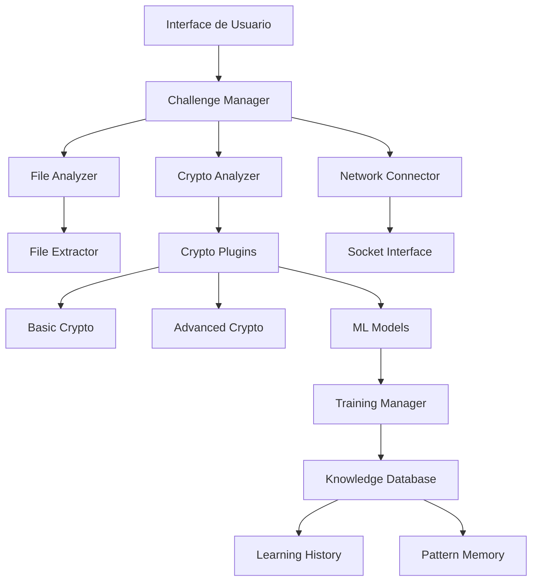

# Documento de Diseño - Crypto CTF Solver

## Visión General

El Crypto CTF Solver es un framework modular e inteligente diseñado para resolver automáticamente desafíos de criptografía y CTF. El sistema utiliza una arquitectura basada en plugins que permite la extensibilidad, combinada con capacidades de aprendizaje automático para mejorar continuamente su efectividad.

### Tecnologías Principales
- **Lenguaje Principal:** Python 3.9+ (por su ecosistema criptográfico robusto)
- **IA/ML:** TensorFlow/PyTorch para modelos de aprendizaje
- **Criptografía:** PyCryptodome, gmpy2, sage (para matemáticas avanzadas)
- **Redes:** asyncio, pwntools para interacciones CTF
- **Compresión:** py7zr, rarfile, tarfile, zipfile

## Arquitectura

### Arquitectura de Alto Nivel



### Componentes Principales

#### 1. Challenge Manager (Gestor de Desafíos)
- **Responsabilidad:** Coordinar la resolución de desafíos
- **Funciones:**
  - Detectar tipo de desafío automáticamente
  - Seleccionar estrategias de resolución apropiadas
  - Coordinar múltiples intentos y técnicas
  - Gestionar timeouts y recursos

#### 2. File Analyzer (Analizador de Archivos)
- **Responsabilidad:** Procesar archivos de entrada
- **Funciones:**
  - Extraer archivos comprimidos (ZIP, RAR, TAR, 7Z)
  - Analizar contenido y metadatos
  - Identificar tipos de archivo y patrones
  - Organizar estructura de trabajo

#### 3. Crypto Analyzer (Analizador Criptográfico)
- **Responsabilidad:** Ejecutar técnicas de criptoanálisis
- **Funciones:**
  - Identificar algoritmos criptográficos
  - Aplicar ataques conocidos
  - Ejecutar análisis matemático avanzado
  - Coordinar con modelos de IA

#### 4. Network Connector (Conector de Red)
- **Responsabilidad:** Manejar interacciones remotas
- **Funciones:**
  - Establecer conexiones TCP/UDP
  - Implementar protocolos de comunicación
  - Manejar sesiones interactivas
  - Automatizar intercambios de datos

## Componentes y Interfaces

### Sistema de Plugins

```python
class CryptoPlugin:
    def can_handle(self, challenge_data: ChallengeData) -> float:
        """Retorna confianza (0-1) de poder resolver el desafío"""
        pass
    
    def solve(self, challenge_data: ChallengeData) -> SolutionResult:
        """Intenta resolver el desafío"""
        pass
    
    def get_techniques(self) -> List[str]:
        """Lista las técnicas que implementa"""
        pass
```

### Plugins Específicos

#### BasicCryptoPlugin
- Cifrados clásicos (César, Vigenère, Atbash)
- Análisis de frecuencia
- Ataques de diccionario
- XOR y operaciones bit a bit

#### RSAPlugin
- Factorización de números grandes
- Ataques Wiener, Hastad, Common Modulus
- Implementación de algoritmos como Pollard's rho
- Detección de claves débiles

#### EllipticCurvePlugin
- Ataques a curvas elípticas débiles
- Invalid curve attacks
- Smart's attack para curvas anómalas
- Pohlig-Hellman para órdenes suaves

#### NetworkPlugin
- Automatización de netcat
- Protocolos de handshake
- Detección de patrones en comunicación
- Inyección de payloads

### Modelos de Datos

```python
@dataclass
class ChallengeData:
    files: List[Path]
    network_info: Optional[NetworkInfo]
    metadata: Dict[str, Any]
    challenge_type: Optional[str]
    difficulty: Optional[int]

@dataclass
class NetworkInfo:
    host: str
    port: int
    protocol: str = "tcp"
    timeout: int = 30

@dataclass
class SolutionResult:
    success: bool
    flag: Optional[str]
    method_used: str
    execution_time: float
    confidence: float
    details: Dict[str, Any]
```

## Manejo de Errores

### Estrategia de Recuperación
1. **Timeout Management:** Límites de tiempo por técnica y globales
2. **Resource Limits:** Control de memoria y CPU
3. **Graceful Degradation:** Fallback a métodos más simples
4. **Error Logging:** Registro detallado para debugging

### Tipos de Error
- `ChallengeTimeoutError`: Tiempo agotado
- `InsufficientDataError`: Datos insuficientes para resolver
- `NetworkConnectionError`: Problemas de conectividad
- `PluginError`: Errores específicos de plugins

## Estrategia de Testing

### Niveles de Testing

#### 1. Unit Tests
- Tests para cada plugin individual
- Validación de algoritmos criptográficos
- Tests de extracción de archivos
- Validación de conexiones de red

#### 2. Integration Tests
- Tests de flujo completo de resolución
- Interacción entre plugins
- Tests de aprendizaje automático
- Validación de persistencia de datos

#### 3. End-to-End Tests
- Resolución de desafíos reales conocidos
- Tests de performance con datasets grandes
- Validación de conectividad remota
- Tests de robustez con datos malformados

### Dataset de Testing
- Colección de desafíos CTF históricos
- Casos de prueba sintéticos
- Desafíos de diferentes niveles de dificultad
- Casos edge y de error

## Sistema de Aprendizaje

### Arquitectura de ML


### Características del Aprendizaje
- **Feature Engineering:** Extracción de características de desafíos
- **Pattern Recognition:** Identificación de patrones en soluciones exitosas
- **Strategy Selection:** Selección inteligente de técnicas basada en historial
- **Continuous Learning:** Mejora continua con nuevos ejemplos

### Modelos Utilizados
- **Classification Models:** Para identificar tipos de desafío
- **Regression Models:** Para estimar dificultad y tiempo de resolución
- **Reinforcement Learning:** Para optimizar secuencias de técnicas
- **Neural Networks:** Para reconocimiento de patrones complejos

## Consideraciones de Seguridad

### Sandboxing
- Ejecución de código no confiable en entornos aislados
- Límites de recursos para prevenir DoS
- Validación de entrada para prevenir inyecciones

### Manejo de Datos Sensibles
- No almacenamiento de flags en logs permanentes
- Cifrado de datos de entrenamiento sensibles
- Limpieza automática de archivos temporales

## Escalabilidad y Performance

### Optimizaciones
- **Paralelización:** Ejecución concurrente de múltiples técnicas
- **Caching:** Cache de resultados intermedios
- **Lazy Loading:** Carga bajo demanda de plugins pesados
- **Resource Pooling:** Reutilización de conexiones y recursos

### Métricas de Performance
- Tiempo promedio de resolución por tipo de desafío
- Tasa de éxito por plugin
- Uso de recursos (CPU, memoria, red)
- Métricas de aprendizaje (precisión, recall)

## Estructura de Directorios

```
crypto-ctf-solver/
├── src/
│   ├── core/
│   │   ├── challenge_manager.py
│   │   ├── file_analyzer.py
│   │   └── network_connector.py
│   ├── plugins/
│   │   ├── basic_crypto/
│   │   ├── rsa/
│   │   ├── elliptic_curve/
│   │   └── network/
│   ├── ml/
│   │   ├── models/
│   │   ├── training/
│   │   └── inference/
│   └── utils/
├── challenges/
│   ├── uploaded/
│   ├── extracted/
│   └── solved/
├── data/
│   ├── models/
│   ├── training_data/
│   └── knowledge_base/
├── tests/
├── docs/
└── config/
```